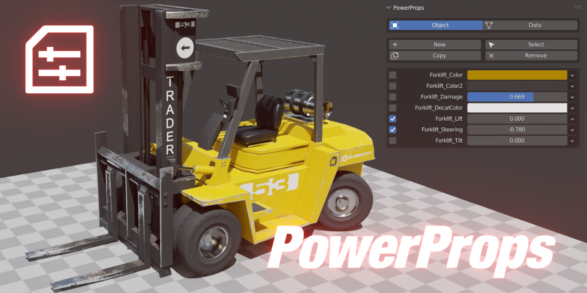

|

Welcome to PowerProps!
====

PowerProps is a Blender addon that helps you create smarter more meaningful objects by managing and applying custom properties and functionality. Store all of your important properties on the object itself. Batch Add, Remove and Copy custom properties, values and drivers to other objects. You can even choose to only copy values to objects that have that property while ignoring others. Quickly select objects with matching properties and values. Create preloaded material nodes to control material properties on a per object basis. Right click to create a connection to drive attributes with custom properties.

|

Requirements
~~~~
**Blender 3.2 or newer**

|

Links
~~~~
`Gumroad <https://bonjorno7.gumroad.com/l/powerprops>`_
|
`BlenderMarket <https://blendermarket.com/products/powerprops>`_
|
`Discord <https://discord.com/invite/xSj7jhRqRQ>`_

.. toctree::
   :maxdepth: 4
   :hidden:
   :caption: PowerProps
   
   overview
   installation
   
.. toctree::
   :maxdepth: 4
   :hidden:
   :caption: Interface
   
   interface
   
.. toctree::
   :maxdepth: 4
   :hidden:
   :caption: Workflow
   
   uses
