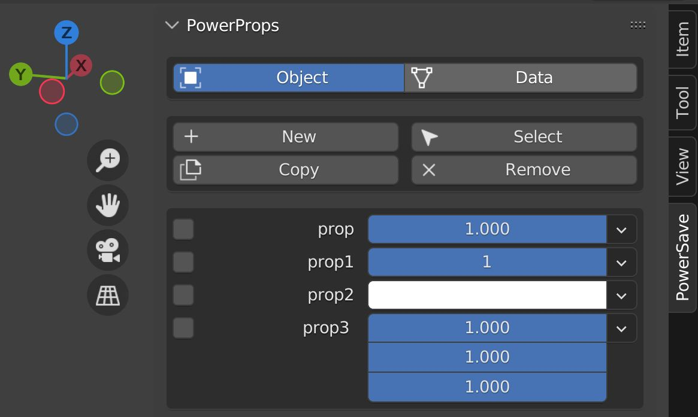
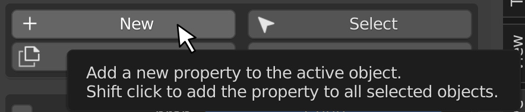
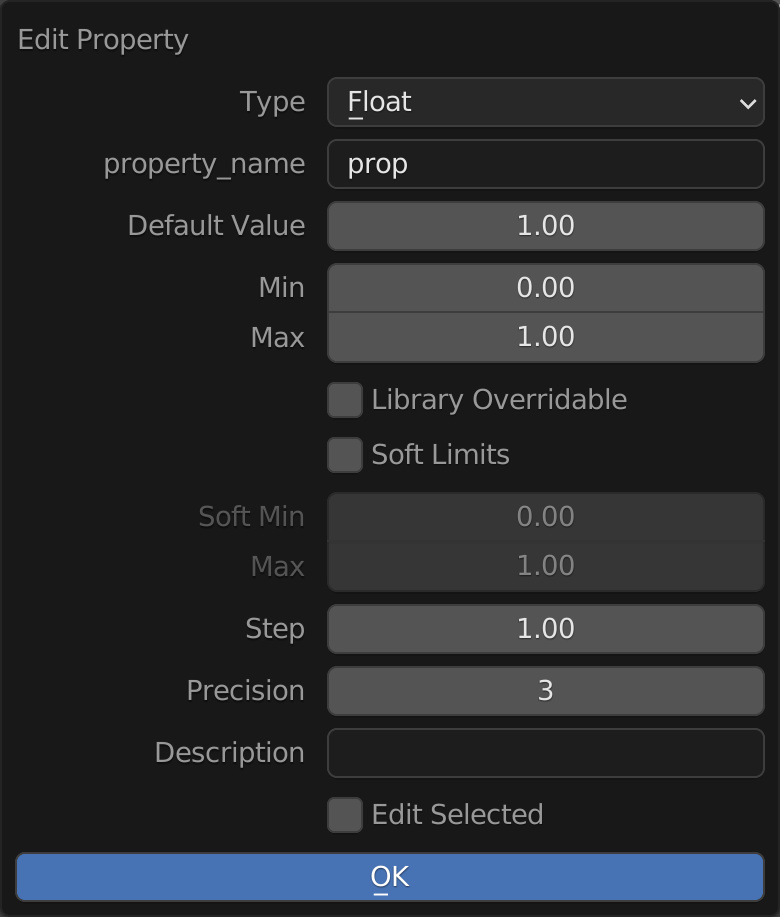
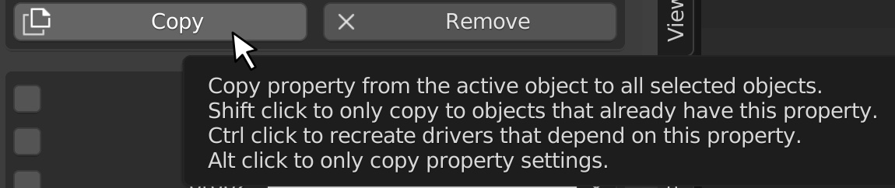
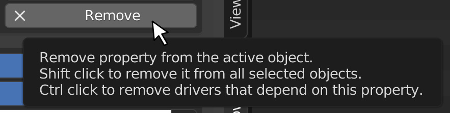
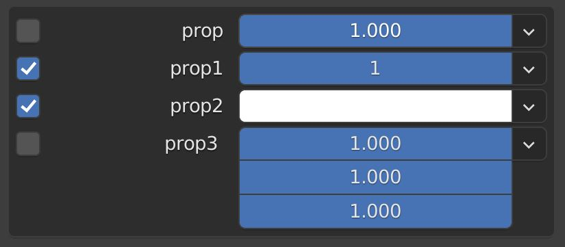
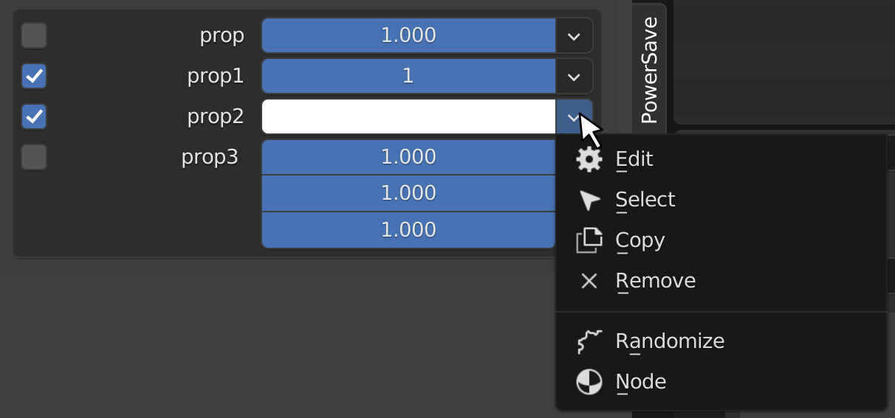

Interface
====

|

The PowerProps panel is simple yet it hides a lot of useful functionality on secondary layers. Mouse-over the buttons to view additional functions that they offer while holding a modifier key.

|

Location
~~~~

|

First choose whether to view properties that are stored on the object or in object data. The typical use case will be on the object itself so that object data can be reused but you may occasionally have a reason to store custom properties in object data.

|

Buttons
~~~~

|

New
----

|

Clicking the New button will create a new custom property on your object and immediately invoke the Edit Property dialogue which will allow you to set a type, give it a name, a default value and a range in which to operate in.

|

|

You can set soft limits to corral values within a certain range while still allowing the user to manually type in more extreme values. You may also want to set stepping and precision control and write a short description to help the user understand how to use the property. The checkbox at the bottom will allow you to do this to all selected objects at once. Shift-clicking the New button will have this option pre-enabled.

|

``The following three buttons require you to have a property selected using its adjacent checkbox to the left of the panel.``

|

Copy
----

|

Simply clicking the Copy button will copy selected custom properties and their current values from the active object to all other selected objects. 

|

Shift-clicking the Copy button will only copy the value of the selected custom property to objects that have the corresponding property while ignoring others.

|

Control-clicking the Copy button will not only copy the selected custom properties and values but also discreetly copy their connected drivers so that destination objects have individual control.

|

Alt-clicking the Copy button will only copy the settings from the custom property and only affect objects with a corresponding property.

|

Select
----

|

Clicking the Select button will select all visible objects that also contain the selected property. If you have two selected properties, it will select the objects that contain both properties.

|

Shift-clicking the Select button will select all visible objects that match the value of the selected property. With two selected properties, it will select the objects that satisfy both values.

|

Remove
----

|

Clicking the Remove button will remove the selected custom properties from the active object.

|

Shift-clicking will remove the selected custom properties from all selected objects.

|

Control-clicking the Remove button will remove the drivers that depend on the selected properties.

|

Properties List
~~~~

|

The Properties List displays all the of the custom properties on the active object. The checkboxes allow you to select multiple custom properties to perform your Copy, Select or Remove actions.

|

Each custom property has its own dropdown that allows you to perform the actions above as well as edit the property itself, randomize the values within a range and create a material Attribute node within the active material that is preloaded with the relevant information to utilize the custom attribute.

|

|

