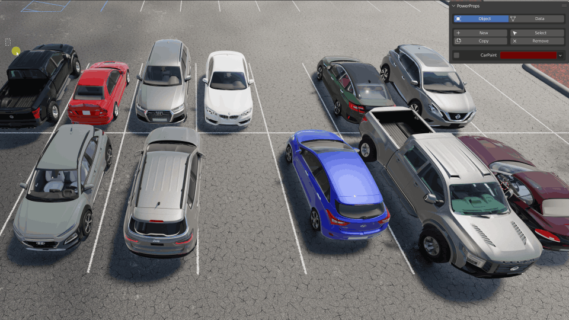
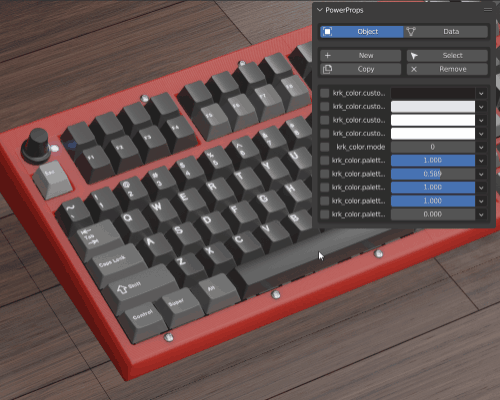
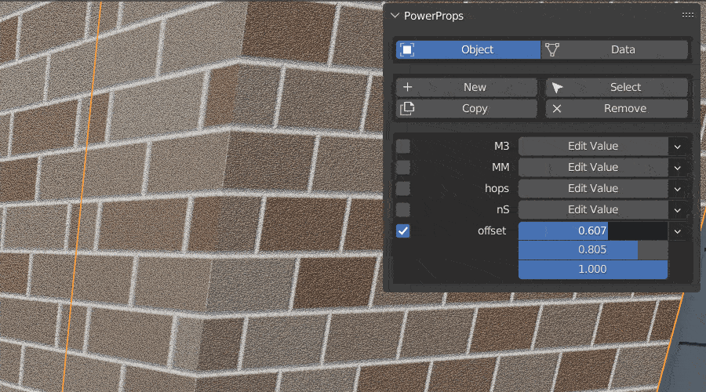
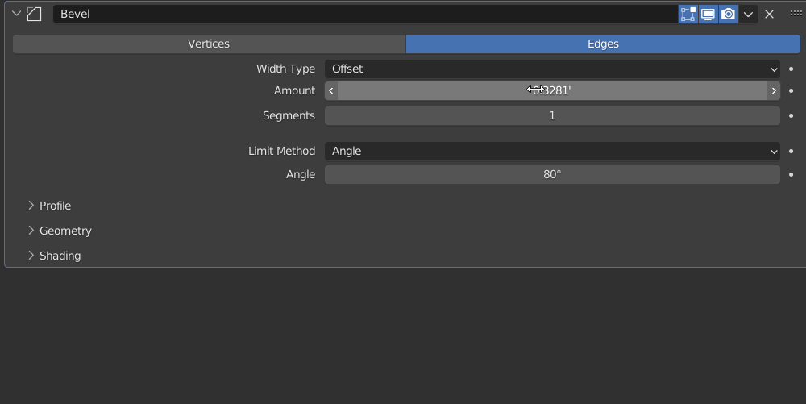

.. image:: img/Forklift_PowerProps.png

Overview
====
| 

PowerProps is a Blender addon that helps you create smarter more meaningful objects by managing and applying custom properties and functionality.

|

.. image:: img/PowerPropsJLG.gif
Put all of your useful properties in one place. 

|

Batch Add, Remove and Copy custom properties or values. You can even choose to only copy a to objects that have that property.

|

Select objects by matching properties and values. 

|

Create preloaded material nodes to control material properties on a per object basis. 

|

Quickly create a connection to drive attributes with custom properties.
